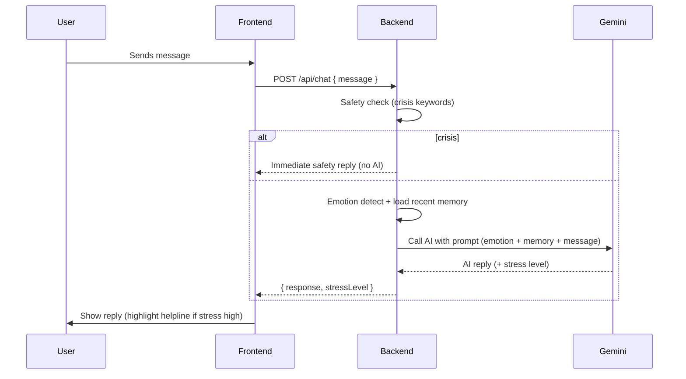

# WizCare Mental Health Chatbot 🧠💚

An AI-powered mental health chatbot built with React, Node.js, and Google Gemini AI. WizCare provides supportive conversations and mental health guidance with a focus on Indian users.

## 🏗️ Project Structure

```
ucare-mental-health-chatbot/
├── backend/                 # Backend server files
│   ├── index.js            # Main server file with Gemini AI integration
│   ├── package.json        # Backend dependencies
│   ├── package-lock.json   # Backend dependency lock file
│   └── node_modules/       # Backend packages
├── frontend/               # React frontend application
│   ├── src/                # Source code
│   │   ├── App.js          # Main React component
│   │   ├── index.js        # React entry point
│   │   └── ...             # Other React files
│   ├── public/             # Public assets
│   ├── package.json        # Frontend dependencies
│   └── ...                 # Other frontend files
├── package.json            # Root project configuration
└── README.md               # This file
```

## ✨ Features

- **🤖 AI-Powered Responses**: Google Gemini AI integration for intelligent conversations
- **🧠 Mental Health Focus**: Specialized in stress, anxiety, and burnout detection
- **🇮🇳 Indian Helpline Integration**: Includes official mental health resources
- **💬 Interactive UI**: Quick reply buttons and modern chat interface
- **🔄 Fallback System**: Demo responses when AI is unavailable
- **📱 Responsive Design**: Works on all devices and screen sizes

## 🚀 Quick Start

### Prerequisites
- Node.js (v16 or higher)
- npm or yarn
- Google Gemini AI API key

### 1. Install Dependencies
```bash
# Install all dependencies (backend + frontend)
npm run install-all

# Or install manually:
npm install
cd backend && npm install
cd ../frontend && npm install
```

### 2. Configure Environment
# Mine Google Gemini API key
GEMINI_API_KEY=your_api_key_here
```

## 🎨 Customization

### Adding New Demo Responses
Edit `backend/index.js` and add to the `DEMO_REPLIES` array:
```javascript
const DEMO_REPLIES = [
  // ... existing responses
  "Your new response here! 💚"
];
```

## 🐛 Troubleshooting

### Common Issues

**Backend won't start:**
- Check if port 5050 is available
- Verify your Gemini API key
- Ensure all dependencies are installed

**Frontend can't connect to backend:**
- Make sure backend is running on port 5050
- Check browser console for CORS errors
- Verify the API endpoint URL

**AI responses not working:**
- Check Gemini API key validity
- Monitor backend console for errors
- Verify internet connection

### Debug Mode
```bash
# Backend with detailed logging
cd backend && DEBUG=* npm start

# Frontend with React DevTools
cd frontend && npm start
```

## 📚 Learning Resources

- **React**: [Official Documentation](https://reactjs.org/)
- **Node.js**: [Official Guide](https://nodejs.org/en/learn/)
- **Material-UI**: [Component Library](https://mui.com/)
- **Google Gemini**: [AI Documentation](https://ai.google.dev/)

## 🤝 Contributing

1. Fork the repository
2. Create a feature branch
3. Make your changes
4. Add tests if applicable
5. Submit a pull request

## 📄 License

This project is licensed under the MIT License - see the LICENSE file for details.

## 🆘 Support

- **Mental Health Crisis**: Call the Indian helpline at 9152987821
- **Technical Issues**: Check the troubleshooting section above
- **Feature Requests**: Open an issue on GitHub

---

**Remember**: UCare is a supportive companion, but it's not a replacement for professional mental health care. If you're in crisis, please reach out to a mental health professional or emergency services.

**Built with ❤️ for better mental health support**

---

## Sequence diagram (chat flow)

Diagram image: `docs/sequence-diagram.png` (generate locally — instructions below)

Mermaid source (renderable in supported viewers):



How to generate PNG locally (optional):

1. Install Mermaid CLI (requires Node.js):

```bash
# install once globally
npm install -g @mermaid-js/mermaid-cli
```

2. Save the mermaid block above to a file, e.g. `diagram.mmd`, then run:

```bash
mmdc -i diagram.mmd -o docs/sequence-diagram.png
```

This will create `docs/sequence-diagram.png`. Commit it to the repo with:

```bash
git add docs/sequence-diagram.png README.md
git commit -m "Add sequence diagram (mermaid) and instructions"
git push origin main
```

If you'd like, I can generate the PNG for you here (I will need permission to install `@mermaid-js/mermaid-cli` and write the file into the repository). Let me know if you want me to run that now.
